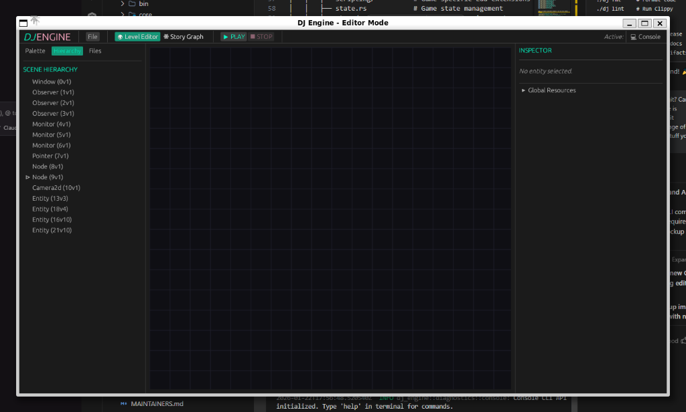

# DJ Engine

<p align="center">
  <strong>A modular game engine for narrative-heavy JRPGs and visual novels</strong>
</p>

<p align="center">
  <a href="https://www.rust-lang.org/"></a>
  <a href="https://bevyengine.org/"></a>
  <a href="LICENSE"></a>
  <a href="https://github.com/djmsqrvve/dj_engine/actions"></a>
</p>

<p align="center">
  
</p>

---

## ✨ Features

| Feature | Description |
|---------|-------------|
| **Story Graph** | Node-based dialogue and narrative branching |
| **Egui Editor** | Visual editor for scenes and story graphs |
| **Lua Scripting** | Runtime scripting via mlua |
| **Data-Driven** | JSON-serializable scenes, databases, and graphs |
| **Modular Design** | Plugin-based architecture for extensibility |

## 🚀 Quick Start

```bash
# Clone the repository
git clone https://github.com/djmsqrvve/dj_engine.git
cd dj_engine

# Run the editor
./dj e

# Run all tests
./dj t

# Build for release
./dj b
```

## 🛠️ CLI Commands

All commands go through the `dj` helper script:

```bash
# Development
./dj e          # Run editor
./dj d          # Run DoomExe game
./dj m          # Run minimal test

# Testing & Quality
./dj t          # Run all tests
./dj c          # Check code compiles
./dj fmt        # Format code
./dj lint       # Run Clippy linter

# Build
./dj b          # Build release
./dj doc        # Generate documentation
./dj clean      # Clean build artifacts
```

## 📁 Project Structure

```
dj_engine/
├── engine/              # Core engine library
│   ├── src/
│   │   ├── core/        # Engine initialization
│   │   ├── data/        # Serializable data types
│   │   ├── editor/      # Egui visual editor
│   │   ├── story_graph/ # Narrative system
│   │   ├── scripting/   # Lua integration
│   │   └── diagnostics/ # Debug tools
│   └── examples/        # Example JSON files
├── games/               # Game projects
│   └── dev/doomexe/     # Main development game
├── docs/                # Documentation
└── tools/               # Asset utilities
```

## 📖 Documentation

| Document | Description |
|----------|-------------|
| [Getting Started](docs/GETTING_STARTED.md) | First-time setup guide |
| [Architecture](docs/ARCHITECTURE.md) | System design overview |
| [Code Style](docs/CODE_STYLE.md) | Coding standards |
| [Testing Guide](docs/TESTING.md) | How to write and run tests |
| [Project Structure](docs/PROJECT_STRUCTURE.md) | Detailed file layout |

## 🛠️ Prerequisites

- **Rust 1.75+** - [Install Rust](https://rustup.rs/)
- **Git** - For version control
- **Linux/WSL2** recommended (Windows native works but may have graphics quirks)

## 🤝 Contributing

We welcome contributions! Please read our [Contributing Guide](CONTRIBUTING.md) before submitting a PR.

- 🐛 [Report a Bug](.github/ISSUE_TEMPLATE/bug_report.md)
- 💡 [Request a Feature](.github/ISSUE_TEMPLATE/feature_request.md)
- 📖 [Improve Documentation](docs/)

## 📜 License

MIT License - see [LICENSE](LICENSE) for details.

---

<p align="center">
  Made with ❤️ by <a href="https://github.com/djmsqrvve">djmsqrvve</a>
</p>
